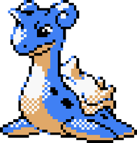
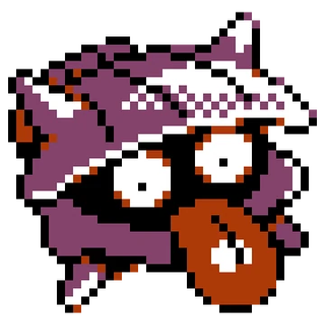

```{r setup}
library(ggplot2)
base_pth <- here::here("posts/2026-03-16-Lapras-Adventure")
```

> People have driven Lapras almost to the point of extinction. In the evenings, this Pokémon is said to sing plaintively as it seeks what few others of its kind still remain.
>
> -- Lapras entry in Pokémon Ruby and Sapphire

Ah, the rare and majestic Lapras. A Pokémon so beloved by fans who were distraught at the news of its near extinction that later Pokémon games have confirmed the conservation and repopulation of Lapras in the wild. My recent post-PhD adventures have involved quite a lot of free time that I didn't used to have, now that I'm out of academia and I have a job that respects my time and work contract. So I recently decided I wanted to play a new Pokémon game, which is great because I loved [Emerald Seaglass](https://ko-fi.com/s/4a1535f351) and the final release of [Pokémon Lazarus](https://ko-fi.com/s/4baddcdbdc) by the same creator, Nemo622, was recently released to a nice amount of online hype. Something about the mildly not-quite-repetitive nature of filling out the Pokédex on my Pokémon Gym Challenge is very zen and relaxing for me, so I love playing ROM hacks and fan games with completable Pokédexes. (I don't have a Switch and I wasn't a big fan of Pokémon Sun, which was the last official title I played, so getting into fan games has been a great way to experience some awesome Pokémon content.)

My dex completion for Lazarus was coming along fine for quite a while. I tend to try to catch at least every wild Pokémon and gift Pokémon in an area before moving on (though I can't be bothered to grind out levels for a [Prof Oak Challenge](https://www.pokecommunity.com/threads/the-professor-oaks-challenge.501577/)). Then, I unlocked Surf and started trying to catch a Lapras. I know that Lapras is traditionally rare -- I started playing Pokémon in Gen 3, got the event Lapras in Leaf Green, and knew about the Sapphire Pokédex entry. So I'm familiar with this rare and majestic sea beast. But then I kept searching and searching with no Lapras in sight. I turned to the documentation to figure out the encounter rate and noted that it was 1%, the rarest encounter rate for a wild Pokémon in that table. I felt like I had done over 100 trials already, but I hadn't actually kept count, so I thought there was no way to know.

::: {#fig-pokes layout-ncol=2}
{width=200}

{width=200}

Lapras and Shellder, shown using their sprites from Pokémon Crystal.
:::

But I've been talking about proxy metrics at work a lot recently, and this was a big focus of my dissertation research. Anyone who knows about my professional career knows I'm very concerned with the way we take measurements. Anyway, I made another choice that happened to turn out very conveniently. I love Moxie [Honchkrow](https://bulbapedia.bulbagarden.net/wiki/Honchkrow_(Pok%C3%A9mon)) and given the option I will almost always include one in my team in a Pokémon game. This allows easy access to the move [Thief](https://bulbapedia.bulbagarden.net/wiki/Thief_(move)), which can take the held items off of wild Pokémon in battles. Since [Shellder](https://bulbapedia.bulbagarden.net/wiki/Shellder_(Pok%C3%A9mon)) co-occurred in the same area where I was looking for Lapras and has a fairly high rate of dropping valuable items, I was using Thief to knock out every Shellder I came across.

So after trying to find my Lapras for a while, I didn't know how many trials I had run (that is, how many encounters I had generated in the same place). But I did know how many [Pearls](https://www.serebii.net/itemdex/pearl.shtml) and how many [Big Pearls](https://www.serebii.net/itemdex/bigpearl.shtml) were in my bag, and I knew I had zero before I started looking for Lapras in this zone. We also know the encounter rate for Lapras and Shellder, and the rate at which wild Shellder will hold Pearls and Big Pearls. Since the Pokémon we encounter are disjoint, and the items Shellder can hold are disjoint, there's a fairly simple probability model here. Instead of knowing how many trials we did and trying to estimate the rate at which something occurs, we know the rate at which everything occurs but not the number of trials we did.

So, given this framework, how do we estimate the number of trials?

## The actual problem: unknown trials, known probabilities

Let's consider the series of encounters
$$
\{X_t\}_{t = 1}^N = \{X_1, X_2, \ldots, X_N\}.
$$

Here, $N$ is the number of encounters I had already generated. That is the quantity I did not write down because I was, apparently, too busy being annoyed at a Lapras-shaped hole in my Pokédex.

For those who may not be familiar with how Pokémon works, the world is divided into a series of zones, and most zones have a few ways to encounter Pokémon: each time you step into a grass tile, a cave (or other dangerous instance like a power plant) tile, or an ocean tile you have a random chance to encounter a wild Pokémon. The wild Pokémon you encounter is then randomly drawn from an encounter table that changes depending on the type of tile you're on, the zone you're in, and potentially other factors like the season or time of day in some games. (BTW if you aren't familiar with Pokémon, Lapras is pronounced like lap-ras, not like la-prah.)

By structuring the problem as a discrete sequence of encounters, we can ignore the random amount of wall-clock time between encounters. I don't care how many minutes I spent surfing back and forth. I care how many times the game rolled on the encounter table.

The important distinction for this post is:

- $N$ is the unknown number of encounters I had already generated.
- $T$ is the time to first Lapras, if we are talking about a future search from scratch.

Those sound similar, and in many toy examples they get blurred together. Here they answer different questions. My increasingly irritated little gamer brain did not only want to know "how long does a 1% encounter usually take?" It wanted to know "how many encounters have I already done, and is this getting ridiculous yet?"

## A short geometric distribution detour

The first question is a classic geometric distribution problem. Suppose we start searching for Lapras with no other information. Let
$$
Z_t = \begin{cases}
1 & \text{if we encounter Lapras at encounter } t, \\
0 & \text{otherwise}.
\end{cases}
$$

If the Lapras encounter probability is $p_\mathrm{Lapras} = 0.01$ and each encounter is an independent roll on the same encounter table, then the trial number of the first Lapras is
$$
T = \min\{t: Z_t = 1\}.
$$

That gives us
$$
Pr(T = t) = p_\mathrm{Lapras}(1 - p_\mathrm{Lapras})^{t - 1}, \quad t = 1, 2, 3, \ldots.
$$

One small R note: `dgeom(x, prob)` uses the "number of failures before the first success" version of the geometric distribution, with support $0, 1, 2, \ldots$. Since I want $T$ to mean the actual trial number where the first success occurs, with support $1, 2, 3, \ldots$, the R code is `dgeom(t - 1, p_lapras)`.

```{r geometric-distribution}
p_lapras <- 0.01

geom_df <- data.frame(
	t = 1:500
)
geom_df$probability <- dgeom(geom_df$t - 1, prob = p_lapras)
geom_df$cumulative <- pgeom(geom_df$t - 1, prob = p_lapras)

ggplot(geom_df, aes(x = t, y = probability)) +
	geom_line(linewidth = 0.8) +
	labs(
		x = "Trial number of first Lapras",
		y = "Pr(T = t)",
		title = "A 1% encounter can take a while"
	) +
	theme_minimal(base_size = 18)
```

Let's talk about this probability distribution a bit, because for me this is fairly unintuitive. We can see that the largest probability is at $t = 1$! But what does that mean? In real life we would be shocked if we saw a 1% Lapras as our first encounter in the zone. For me, this has to do with a mismatch between "the most likely single event" and "what we expect to happen if we repeat this process many times."

The fact that $Pr(T = 1) = 0.01$ can be interpreted as "1 is the most probable value of $T$", which is true. But it also means something along the lines of "if we repeat the process of trying to catch a Lapras 100 times, we would expect to get Lapras in the first encounter only once." Since there are infinitely many possibilities for how long it can take us to get Lapras (2, 3, 4, and so on), there is way more combined probability for larger numbers.

```{r geometric-summary}
geom_summary <- data.frame(
	quantity = c("mean", "median", "90% chance by", "95% chance by"),
	encounters = c(
		1 / p_lapras,
		qgeom(0.5, p_lapras) + 1,
		qgeom(0.9, p_lapras) + 1,
		qgeom(0.95, p_lapras) + 1
	)
)

knitr::kable(geom_summary, digits = 0)
```

The expected value is 100 encounters, which is the familiar "1 in 100" intuition. But the median is only `r qgeom(0.5, p_lapras) + 1` encounters, and we need `r qgeom(0.95, p_lapras) + 1` encounters before the cumulative probability of seeing at least one Lapras gets above 95%. Rare events have long right tails. This is annoying, but it is not surprising.

But this still does not quite solve my actual problem. The geometric distribution tells us what I should expect before I start looking for Lapras, assuming I know nothing except the Lapras encounter rate. It answers the question "how long does a 1% encounter usually take?" That's useful, but it doesn't answer the more annoying question I actually had while sitting there surfing back and forth: "how many encounters have I already done?" That is where the Shellders come in.

## Shellders, Pearls, and proxy measurements

In the encounter table I was using, the relevant documentation values are listed in the [Pokémon Lazarus encounter documentation](https://www.pokeharbor.com/wp-content/uploads/2025/03/Pokemon-Lazarus-Documentation-Encounters.pdf) and in [Shellder's held-item data](https://mrwalkthroughs.com/pokemon-lazarus/pokedex/shellder/), which lists Pearl as common and Big Pearl as rare. For the model below, that gives:

```{r documented-probabilities}
p_shellder <- 0.60
p_pearl_given_shellder <- 0.50
p_big_pearl_given_shellder <- 0.05

probability_table <- data.frame(
	quantity = c(
		"Lapras encounter",
		"Shellder encounter",
		"Pearl given Shellder",
		"Big Pearl given Shellder"
	),
	probability = c(
		p_lapras,
		p_shellder,
		p_pearl_given_shellder,
		p_big_pearl_given_shellder
	)
)

knitr::kable(probability_table, digits = 2)
```

The Lapras probability is what motivates the problem, but the Shellder items are what give us the proxy measurement. If Shellder appears with probability $p_S$, and a Shellder holds a Pearl with probability $p_P$, then the probability that a generated encounter produces a stealable Pearl is
$$
\pi_P = p_S p_P.
$$

Similarly, the probability that a generated encounter produces a stealable Big Pearl is
$$
\pi_B = p_S p_B.
$$

Using the values above, this gives us:

```{r item-probabilities}
pi_pearl <- p_shellder * p_pearl_given_shellder
pi_big_pearl <- p_shellder * p_big_pearl_given_shellder
pi_other <- 1 - pi_pearl - pi_big_pearl

item_probability_table <- data.frame(
	outcome = c("Pearl from Shellder", "Big Pearl from Shellder", "Anything else"),
	probability = c(pi_pearl, pi_big_pearl, pi_other)
)

knitr::kable(item_probability_table, digits = 3)
```

The "anything else" category is doing a lot of work here. It includes non-Shellder encounters, Shellders with no item, and any other encounter that didn't add a Pearl or Big Pearl to my bag. For this purpose, that is fine. We only need enough categories to describe the information we actually observed.

This is a proxy measurement, not a direct measurement. I didn't count encounters. I counted two item outcomes that are probabilistically related to encounters. Proxy measurements are useful, but they make the uncertainty very explicit: lots of different encounter counts could plausibly produce the same item counts.

## Estimating the number of encounters from item drops

Now we can write down the main model. Let:

- $N$ be the unknown number of encounters already generated.
- $Y_P$ be the observed number of Pearls.
- $Y_B$ be the observed number of Big Pearls.
- $Y_O$ be everything else.

Conditional on $N$, the observed item counts follow a multinomial distribution:
$$
(Y_P, Y_B, Y_O) \sim \mathrm{Multinomial}
\left(N, (\pi_P, \pi_B, 1 - \pi_P - \pi_B)\right).
$$

This is a nice little model because $N$ is the only unknown thing we care about. We can compute the likelihood for a grid of plausible $N$ values, normalize it, and treat the result as a posterior distribution over $N$. To get a real Bayesian estimate here, you would want to be serious about your priors, but I'm just going to do something easy, ignoring any real information about conjugate priors or something that could be useful. You *might* be able to solve this analytically and get the MLE, but I'm not confident enough in the existence of a closed form solution to do that.

```{r observed-counts}
# TODO: Fill these in from the actual save file/bag counts before publishing.
# These should be the numbers of Pearls and Big Pearls collected from Shellder
# before starting the direct encounter counts described later in the post.
y_pearl <- 55L
y_big_pearl <- 20L
```

```{r estimate-n-from-items}
estimate_n_from_items <- function(
	y_pearl,
	y_big_pearl,
	pi_pearl,
	pi_big_pearl,
	n_max = 1000L
) {
	n_min <- y_pearl + y_big_pearl
	n_grid <- n_min:n_max
	pi_other <- 1 - pi_pearl - pi_big_pearl

	log_lik_n <- vapply(
		n_grid,
		FUN.VALUE = numeric(1),
		FUN = function(n) {
			y_other <- n - y_pearl - y_big_pearl

			lfactorial(n) -
				lfactorial(y_pearl) -
				lfactorial(y_big_pearl) -
				lfactorial(y_other) +
				y_pearl * log(pi_pearl) +
				y_big_pearl * log(pi_big_pearl) +
				y_other * log(pi_other)
		}
	)

	log_post_n <- log_lik_n - max(log_lik_n)
	post_n <- exp(log_post_n)
	post_n <- post_n / sum(post_n)

	data.frame(n = n_grid, posterior = post_n)
}


n_posterior <- estimate_n_from_items(
	y_pearl = y_pearl,
	y_big_pearl = y_big_pearl,
	pi_pearl = pi_pearl,
	pi_big_pearl = pi_big_pearl
)
```

Next we summarize the posterior TODO fix this.

```{r n-posterior-summary}
summarize_n_posterior <- function(n_posterior) {
	cdf <- cumsum(n_posterior$posterior)

	data.frame(
		quantity = c("mean", "median", "2.5%", "97.5%"),
		encounters = c(
			sum(n_posterior$n * n_posterior$posterior),
			n_posterior$n[which(cdf >= 0.5)[1]],
			n_posterior$n[which(cdf >= 0.025)[1]],
			n_posterior$n[which(cdf >= 0.975)[1]]
		)
	)
}

if (has_proxy_counts) {
	n_summary <- summarize_n_posterior(n_posterior)
	knitr::kable(n_summary, digits = 1)
} else {
	cat("TODO: add y_pearl and y_big_pearl to summarize the posterior over N.")
}
```

And we can make a nice plot of the posterior distribution of $N$. TODO fix this

```{r n-posterior-plot}
if (has_proxy_counts) {
	ggplot(n_posterior, aes(x = n, y = posterior)) +
		geom_line(linewidth = 0.8) +
		labs(
			x = "Unknown number of encounters already generated (N)",
			y = "Posterior probability",
			title = "Plausible encounter counts from Pearl and Big Pearl drops"
		) +
		theme_minimal(base_size = 18)
} else {
	plot.new()
	text(
		x = 0.5,
		y = 0.5,
		labels = "TODO: add observed Pearl and Big Pearl counts",
		cex = 1.2
	)
}
```

Once the actual Pearl and Big Pearl counts are filled in, this table and plot give the main estimate for $N$. The thing to notice is not just the middle of the distribution, but the width. Even with known probabilities, a proxy measurement is still noisy. If I get fewer Pearls than expected, that could mean I did fewer encounters, or it could mean I did plenty of encounters and the Shellders were simply being unhelpful. Probability, as usual, refuses to validate my feelings on command.

## So, was this actually a lot of trials?

The proxy model estimates how many encounters I probably generated. The next question is separate: given that many encounters, how surprising is it that I had not seen Lapras yet?

If the number of encounters were known to be $N$, the probability of seeing no Lapras would be
$$
Pr(\text{no Lapras} \mid N) = (1 - p_\mathrm{Lapras})^N.
$$

But we do not know $N$. We have a posterior distribution over plausible values of $N$, so we average over that uncertainty:
$$
Pr(\text{no Lapras}) =
\sum_N Pr(\text{no Lapras} \mid N)Pr(N \mid Y_P, Y_B).
$$

This is pretty easy to do with code. TOOD fix this.

```{r no-lapras-probability}
if (has_proxy_counts) {
	prob_no_lapras <- sum(
		n_posterior$posterior * (1 - p_lapras)^n_posterior$n
	)

	prob_seen_lapras <- 1 - prob_no_lapras

	no_lapras_summary <- data.frame(
		quantity = c("Pr(no Lapras yet)", "Pr(at least one Lapras by now)"),
		probability = c(prob_no_lapras, prob_seen_lapras)
	)

	knitr::kable(no_lapras_summary, digits = 3)
} else {
	cat("TODO: add observed Pearl and Big Pearl counts to compute the luck check.")
}
```

This calculation tells us if I was actually unlucky or just whining too much. If `Pr(no Lapras yet)` is still fairly large, then my experience was annoying but not really unusual. If it is tiny, then I would be validated at least by the laws of statistics. Obviously, that is not how probability works in the moral sense; the next encounter does not care how wronged I feel. But as a diagnostic for "am I in an unusually unlucky tail of the distribution?", this is the right number.

One modeling note: I am intentionally keeping the proxy-estimation model and the no-Lapras check conceptually separate. We could condition the whole model on the fact that I had not seen Lapras yet, because that is also information about $N$. But for this post I want the proxy measurement to do one job. The no-Lapras calculation is separate, just trying to figure out if I got unlucky. Combining them is possible, but it makes the example less clean.

## Adding direct measurements and finally getting Lapras

After doing this little analysis, I started counting direct trials. This was, admittedly, the obvious thing to do from the beginning, but the whole point is that I did not do it from the beginning.

The direct counts I wrote down were:

- 53 additional trials at 1% with no Lapras.
- 18 trials at 5% before the first Lapras.

The second line happened after I switched to a different encounter method or table with a 5% Lapras rate. At that point, the problem was no longer "can I infer how many encounters I already generated?" It was just me being ready to move to the next Pokémon in the dex.

```{r direct-measurements}
prob_no_lapras_53_at_1 <- (1 - 0.01)^53
prob_first_by_18_at_5 <- 1 - (1 - 0.05)^18

direct_summary <- data.frame(
	question = c(
		"No Lapras in 53 more 1% encounters",
		"At least one Lapras within 18 encounters at 5%"
	),
	probability = c(
		prob_no_lapras_53_at_1,
		prob_first_by_18_at_5
	)
)

knitr::kable(direct_summary, digits = 3)
```

No Lapras in 53 more 1% encounters has probability `r round(prob_no_lapras_53_at_1, 3)`, so that part by itself is not unusual. Getting Lapras within 18 trials at a 5% encounter rate has probability `r round(prob_first_by_18_at_5, 3)`, which is also a very normal thing to happen. 

TODO revise this section

The lesson, for me, is not just about Pokémon. When I was stuck waiting for Lapras, my internal measurement system was basically "this is taking forever." That is a real experience, but it is a bad estimator. The Pearls and Big Pearls were not the thing I cared about, but they were connected to the thing I cared about through known probabilities. That made them a useful proxy.

Proxy metrics are never magic. They need assumptions, and they can be noisy or misleading. Here, I assumed the encounter table stayed fixed, the documented encounter and item rates were correct, I stole from every Shellder I saw, and my bag counts were clean because I started with zero. Those assumptions are doing real work. But under those assumptions, the proxy gave me something much better than my memory: a distribution over how much searching I had probably done.

And then, eventually, I caught Lapras. Probability did not owe me that outcome, but I appreciated it anyway.

## Details {.appendix}

* I do not own any assets related to Pokémon or Pokémon Lazarus, nor am I affiliated in any capacity with either. Any content used here, including the sprites, is reproduced under fair use and is not distributed under the licensing terms of my blog.
* This document was last updated at `r Sys.time()`. The complete `R` session
information is reproduced below.

```{r session info}
sessioninfo::session_info()
```

<!-- END OF FILE -->
